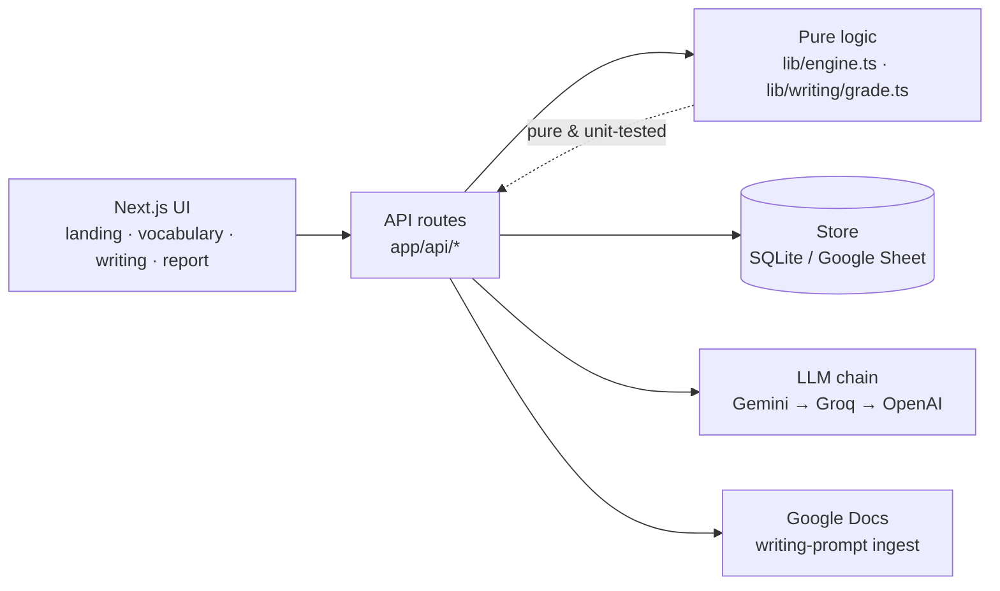

# Lexi

[](https://github.com/MrTToan/vocab-app/actions/workflows/ci.yml)

A personal English **practice engine** — *not* a flashcard notebook. Two modules behind one landing page:
**Vocabulary** (words climb a mastery ladder; an active-recall picker decides what you drill) and
**IELTS Academic Writing** (write Task 1 / Task 2 responses and get band-scored feedback with inline
corrections and coaching). An LLM enriches words and scores what you write. Built for one learner
(intermediate B1–B2, L1 Vietnamese).

> **Scope, honestly:** a single-user, local-first tool I built for my own study. It's **not deployed**
> and has **no auth by design** — a deliberate choice for a personal app, not an oversight. See
> [Design decisions](#design-decisions--tradeoffs).

## What it does

**Vocabulary:**
- **Active-recall practice**, not passive review — every exercise makes you *produce* or *recall*, never
  just multiple-choice recognise. Exercises get harder as a word climbs.
- **Typed, two-way flashcards** validated against the database (no self-grading), plus cloze,
  type-the-word, and LLM-scored writing/translation/scenario tasks.
- **A pre-generated, self-refilling question bank** so questions never repeat.

**IELTS writing:**
- **Task 1 (charts) & Task 2 (essays)** scored on the four official criteria with an overall band.
- **Google-Docs-style feedback** — inline corrections you hover/click to a side note, an error-type
  breakdown, and a **"How to raise your band"** coaching section (prioritised, essay-specific improvements
  with a why, a how, and a model sentence).
- **Pick what to practise** from a question list showing your past scores; **review** a past attempt
  without redoing it, or **export the report to PDF**.
- Questions ingested from **your own Google Docs**; Task 1 charts are read once and stored as ground truth
  (no vision model at runtime).

**Across both:**
- **Multi-provider LLM** with an ordered fallback chain, and full **graceful degradation** — the whole
  typed-practice loop works with **no API key at all**.
- A **cross-skill report** (`/report`) with hand-built charts (no chart dependency).

Plain-language, feature-by-feature docs live in **[`docs/features/`](docs/features/)**.

## How it works



The domain logic is deliberately **pure and isolated** so it can be unit-tested without a DB or network:
the stage ladder, the weighted picker, answer-matching, and question-harvesting all live in `lib/*` as
side-effect-free functions. Storage and LLM access sit behind small interfaces the app never bypasses.

**The learning model:** words climb **New → Recognition → Recall → Production → Known**. A correct (or
near-miss) answer moves a word up a rung; a wrong one moves it down. **4 non-incorrect answers in a row**
masters a word to *Known* and retires it from rotation. A weighted picker keeps ~35 words in active
rotation, favouring ones you recently got wrong or haven't seen in a while.

## Run it

```bash
npm install
npm run dev        # http://localhost:3001  (landing at /, app at /vocab · /writing · /report)
```

It runs with **no API key** — typed flashcards, cloze, type-the-word and all local grading work fully.
Add a provider to unlock word enrichment and sentence scoring (see
[`docs/SETUP-LLM-PROVIDERS.md`](docs/SETUP-LLM-PROVIDERS.md)). Your data lives in a local SQLite file
(`.data/lexi.db`) and your keys in `.env.local` — both gitignored.

## Tests

```bash
npm run typecheck  # tsc --noEmit
npm test           # vitest
```

Unit tests cover the **pure domain logic** — `engine` (stage ladder, picker, mastery), `grade`
(local answer matching), `spell`, `cloze`, `harvest`, `ui`, and `writing/grade` (word count, band
clamping, correction-span location, error aggregation). The rule of the repo: a change isn't done until
`npm test` is green. *(Honest gap: integration/E2E coverage of the API + practice UI isn't here yet —
the current suite is deliberately the fast, pure core.)*

## Design decisions & tradeoffs

Where I made a call and why — including what I'd want a reviewer to know:

- **SQLite (libSQL), local-first** — single user, zero-ops, instant. The same client points at hosted
  **Turso** with no code change if it ever needs to be online.
- **No spaced-repetition scheduler (no SRS)** — a weighted active-set picker reproduces the *feel* of
  spacing/interleaving using plain counters, without due-date bookkeeping.
- **Streak-based mastery over accuracy thresholds** — I tried a "≥85% over last 5 + ≥8 views" gate
  first; inspecting real data showed it was effectively unreachable, so mastery is now "4 correct in a
  row." Attainable and intuitive.
- **A fallback chain, free tiers first** — Gemini → Groq (free) → OpenAI (paid, last resort); a strict
  3-strike circuit breaker drops to the next provider so a rate-limited free tier never blocks practice.
- **A self-refilling question bank** — good LLM output (model corrections, live-generated exercises,
  enrichment examples) is harvested back into the bank instead of paying to regenerate it.

**Known tradeoffs I'm aware of** (fine at this scale, flagged for honesty):
`pickNext` reads the full word table on each pick (O(n); imperceptible at ~1k words); schema evolution is
ad-hoc (`CREATE TABLE IF NOT EXISTS` plus try/catch `ALTER TABLE ADD COLUMN` in the writing store — no
formal migration framework yet); the circuit-breaker state is a module global (correct for one local
process, not multi-instance safe); and everything assumes a **single user** (no `user_id` on records).

## Project layout

| Path | What's there |
|------|--------------|
| `lib/` | Pure logic — `engine`, `grade`, `spell`, `cloze`, `harvest` — plus the `store` and LLM `providers` interfaces |
| `lib/writing/` | The writing module — score schema, pure `grade`, prompt, guidance loader, and its own store |
| `app/` | Next.js App Router — `(marketing)` landing + `(app)` pages, and `app/api/*` routes |
| `components/writing/` | The writing workspace + feedback UI |
| `content/writing/` | Google-Doc source links, guidance markdown, processed prompts |
| `tests/` | Vitest unit tests for the pure logic |
| `docs/features/` | Plain-language guide to how each feature behaves |
| `PRD.md` · `TECH.md` · `STATUS.md` · `docs/WRITING-SPEC.md` | Product intent · architecture · current snapshot · writing design |
| `CHEATSHEET.md` | Everyday commands (run, review questions, ingest prompts, back up data) |

## Stack

Next.js 16 (App Router, Turbopack) · React 19 · TypeScript · Tailwind v4 · SQLite/libSQL · Zod ·
Vitest. LLM I/O is structured JSON, Zod-validated.

## License

[MIT](LICENSE)
