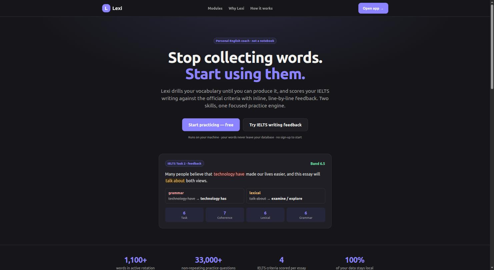
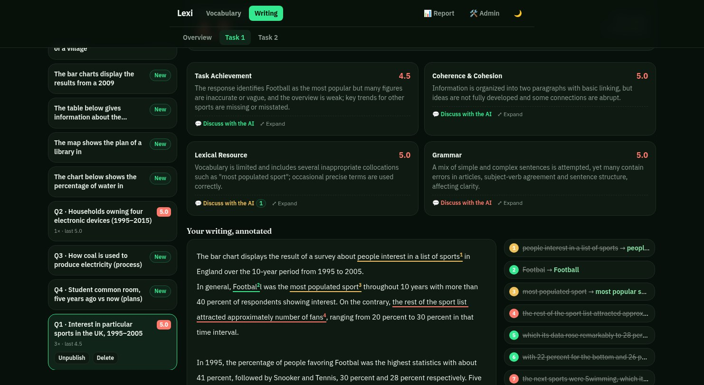
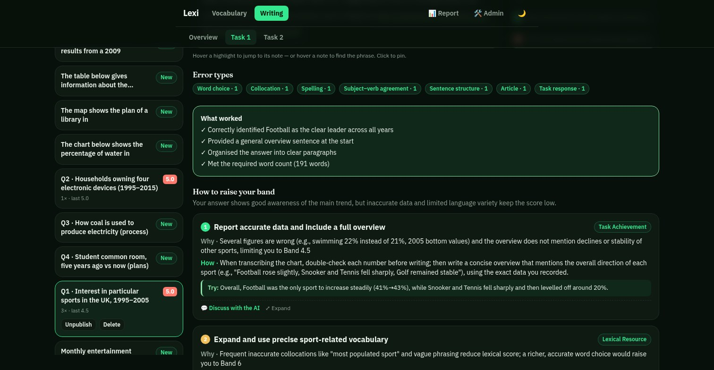
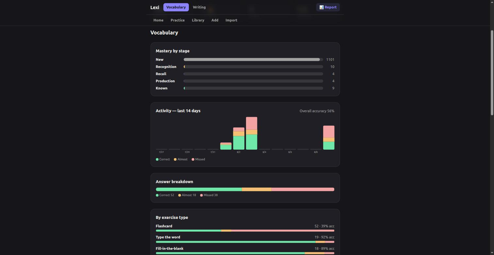

# Lexi

**A practice engine for English that refuses to call a word "learned" until you can produce it from memory.**

## The idea

Most vocabulary apps are notebooks with a quiz attached. You collect words, you flip through them, you tap "got it", and a green checkmark tells you a story that your next essay quietly contradicts. Recognising a word on a card is easy. Reaching for it mid-sentence, unaided, is the thing that actually matters — and it is the thing almost nobody practises.

Lexi is built around that gap. It treats every word as a claim you have to keep proving, moves the goalposts as you get better, and brings back whatever you're starting to lose before you notice it slipping. The same instinct drives its IELTS Writing feedback: not a spellchecker with a band number stapled on, but an examiner's read of *why* you're at the band you're at and what specifically would move you up.

## Try it live

👉 **[lexi.vnfriends.com](https://lexi.vnfriends.com)** — sign in with Google and start straight away. Free to start.

New here? The **[How it works guide](https://lexi.vnfriends.com/how-it-works)** walks through everything in plain English, starting with a five-minute quickstart.

## How Lexi thinks about vocabulary

**Knowing a word is a ladder, not a checkbox.** Every word sits on one of five rungs:

| Rung | What it means you can do |
|---|---|
| **New** | You've just met it, in context, with no pressure. |
| **Recognition** | You can spot it in a sentence and fill the gap. |
| **Recall** | Given only the meaning, you can retrieve the word. |
| **Production** | You can use it yourself — in a sentence, a translation, a real reply. |
| **Known** | Mastered. It steps out of rotation so you can focus on the rest. |

A correct answer climbs one rung; a miss drops one. Nothing reaches *Known* on a single good day — it takes a run of four good answers in a row, and the top of the ladder always demands that you *use* the word, not just spot it. Mastery is earned, not marked.

**The exercise is chosen by the word's rung, not by you.** A brand-new word gets a gentle flashcard. A word you can recognise gets a cloze gap. A word you can recall gets the meaning alone and asks for the English. Near the top, Lexi asks you to translate, write your own sentence, or say the right thing in a real situation — graded for meaning, with a better model to compare against. This is deliberate: because the *kind* of question changes as the word climbs, you can't game the system by memorising which answer to tap. Each rung asks more of you than the last, and that escalation is the whole point.

**Active recall beats passive review.** Every exercise makes you retrieve or produce something before you see the answer — there's no self-grading, no "I knew that" button. Retrieval is what builds durable memory; re-reading only builds familiarity, which feels like knowledge right up until you need it.

**Weak and stale words come back on their own.** Lexi keeps a small working set of words live at any time and quietly decides what you see next. A word you just missed returns first. A word your accuracy is slipping on gets pushed forward. A word you haven't seen in a few days resurfaces before you'd have forgotten it. Mastered words fade out to make room. You never build a review schedule, and nothing is ever marked "done" and forgotten — the words you're losing are exactly the ones that keep showing up.

**Grading is forgiving on purpose.** A small typo counts as "Almost", not wrong. Meaning matters more than perfect spelling; Vietnamese answers ignore accents and accept any part of the meaning. Lexi is checking whether you know the word, not whether you typed it perfectly.

## Writing feedback that reads like an examiner

Vocabulary is half the battle; the Writing module is where you prove it in full essays. Write an IELTS Task 1 or Task 2 answer — your own prompts, including a chart image for Task 1 — and submit one clean attempt, scored as it stands.

What makes the feedback genuinely examiner-like rather than red-pen corrections:

- **Scored the way the exam scores you.** A band estimate overall and on each of the four official criteria — Task Achievement, Coherence & Cohesion, Lexical Resource, Grammatical Range & Accuracy — so you know *which* skill is holding the band down, not just that something is.
- **Inline corrections on your actual sentences,** each with what to change, why, and a stronger word to use — read through sentence by sentence.
- **Coaching on the levers to your next band.** Instead of a wall of fixes, a few higher-level priorities — the specific moves that separate your current band from the one above — each with a model sentence so you can copy the shape, not just the words. Your strengths are named too, so you keep what's working.
- **Ask the AI "why".** Every criterion score, every coaching point and every inline fix has its own discussion thread. Disagree with a band? Ask it to justify. Don't understand a correction? Ask for a rewrite or a Vietnamese explanation. Answers are grounded in your own essay and quote your words back to you, and the conversations are saved with the feedback.

Over time, the Report shows your band trend, your average per criterion, and your most common mistakes — so the next essay starts from what the last one taught you.

## Everywhere you learn

- **Paste a list, get a word bank.** Drop in up to 200 words and Lexi fills in the Vietnamese meaning, an English definition, part of speech, pronunciation, synonyms, collocations and example sentences — catching misspellings and skipping duplicates along the way. Nothing is saved until you say so.
- **Ready-made packs** to start immediately: IELTS Task 1, IELTS Task 2, Casual English 100 and Academic Writing 100. Practise a pack before adopting it; add it and keep any progress you've already made.
- **Collections are lenses, not copies.** A word can live in several collections, and your progress on it is the same everywhere it appears.
- **One report for both halves** — mastery by rung, weak words, your daily streak, accuracy per exercise type, and your writing bands over time. Nothing to log yourself; it all comes from real practice.
- **Works on your phone,** built for spare minutes. Your progress follows your sign-in, so you can practise on the bus and pick up on your laptop exactly where you left off.

## Screenshots

| IELTS writing feedback | How to raise your band — coaching |
|---|---|
|  |  |

**Progress report**

## License

[MIT](LICENSE)
